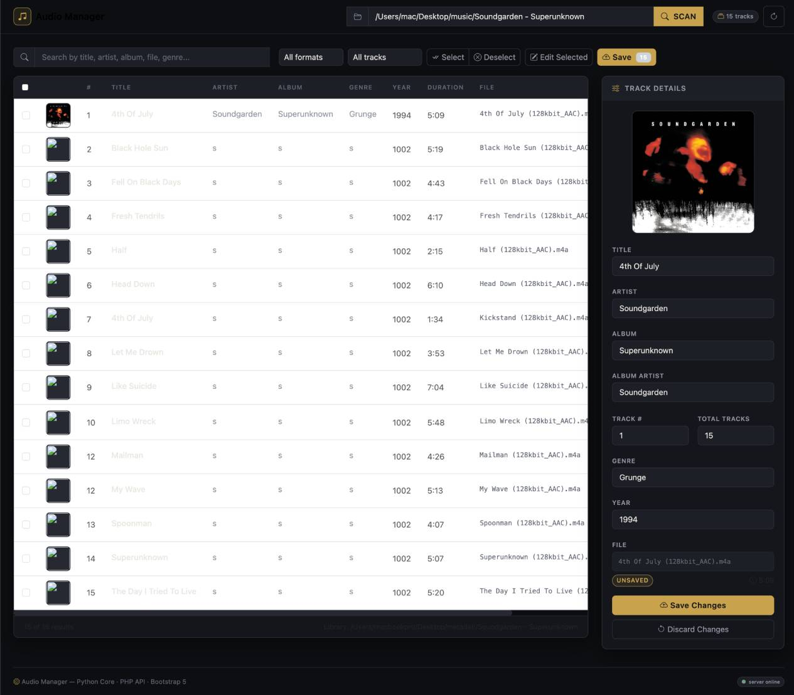
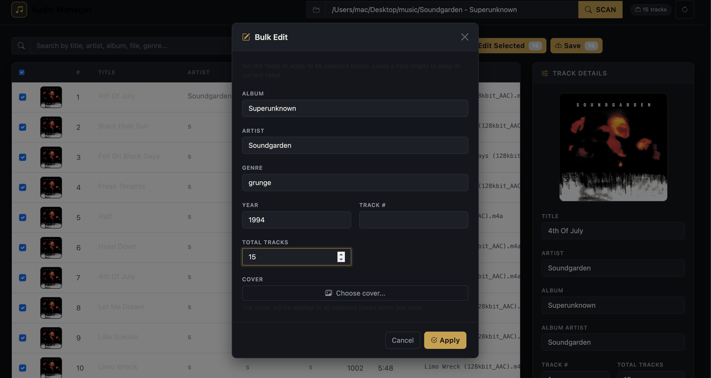

# Audio Metadati Manager

Audio Metadati Manager is a web-based application for managing your music library's metadata and album artwork. Python (via [mutagen](https://mutagen.readthedocs.io/)) performs all the audio operations, while PHP provides the web/API layer and a modern responsive interface built with HTML5, Bootstrap 5 and vanilla JavaScript.

A command-line interface (CLI) for the same Python core is also included.

## Features

- Web-based audio metadata management
- Command-line interface (CLI) included
- MP3, FLAC and M4A support
- Edit metadata: title, artist, album, album artist, track number, total tracks, genre, year
- Bulk editing of multiple tracks at once
- Search across title, artist, album, genre and filename
- Filter by format (MP3/FLAC/M4A) and status (unsaved/saved)
- Album cover management:
  - JPEG/JPG files in the same folder as the audio are detected automatically (case-insensitive)
  - Choose between the available images
  - Embed the selected cover into the audio file when saving (original JPEG is never modified)
  - Remove an embedded cover without deleting the source JPEG
  - Apply a cover to all tracks in an album/folder at once
  - No automatic cover downloads from the Internet
- Clear unsaved/saved status indicators
- Elegant, responsive dark UI (desktop, notebook, tablet)
- Usable over a local network (LAN)

## Screenshots

### Main interface



### Bulk changes



## Architecture

```
Browser
   |
   v
HTML + Bootstrap + JavaScript
   |
   v
PHP API
   |
   v
Python audio core (mutagen)
   |
   v
Audio files
```

- **Browser** – the responsive interface built with HTML5, Bootstrap 5 and vanilla JavaScript.
- **PHP API** – validates input, secures paths, and executes the Python core as a subprocess. It is the only web-facing layer.
- **Python core** – `python/core.py` reads and writes audio metadata and embedded covers using mutagen. The `python/comm.py` module exposes a JSON command-line interface that PHP calls.
- **Audio files** – never re-encoded; only metadata tags and embedded artwork are modified, and only when you explicitly save.

## Requirements

| Component | Requirement |
|-----------|-------------|
| Python | 3.8 or newer |
| PHP | 8.0 or newer |
| Python package | `mutagen` (see `requirements.txt`) |
| Browser | A modern browser (Chrome, Firefox, Safari, Edge) |
| OS | Linux, macOS, or Windows (PHP and Python must be installed) |

No PHP extensions or Composer are required. The application uses only the PHP built-in web server.

## Installation

### 1. Clone the repository

```bash
git clone https://github.com/<your-user>/audio-manager.git
cd audio-manager
```

### 2. Install with the provided script

```bash
./install.sh
```

The script checks for PHP and Python, creates a virtual environment, installs `mutagen`, and prepares `web/config.local.php` from the example file.

### Manual installation

Create a Python virtual environment and install the dependency:

```bash
python3 -m venv .venv
source .venv/bin/activate
pip install -r requirements.txt
```

### PHP installation

- **Debian / Ubuntu**

  ```bash
  sudo apt-get update
  sudo apt-get install php python3 python3-venv python3-pip
  ```

- **macOS**

  ```bash
  brew install php python3
  ```

- **Windows**

  Download and install PHP from [php.net](https://www.php.net/downloads) and Python from [python.org](https://www.python.org/downloads/), then make sure both are available on your `PATH`.

## Configuration

The application needs to know where your music library is. There are three ways to configure it, in order of precedence:

1. **Local configuration file** – copy the example and edit it:

   ```bash
   cp web/config.example.php web/config.local.php
   ```

   Then set your path in `web/config.local.php`:

   ```php
   define('AUDIO_LIBRARY_PATH', '/path/to/your/music');
   ```

   `web/config.local.php` is ignored by Git and never committed.

2. **Environment variable**

   ```bash
   export AUDIO_LIBRARY_OVERRIDE=/path/to/your/music
   ```

3. **No configuration** – if neither of the above is set, the application starts with an empty library and you can type a path directly in the web interface.

> Replace `/path/to/your/music` with the actual path of your music folder.

## Starting the application

### Using the script

```bash
./start.sh
```

The server listens on `http://localhost:8000`. To use a different port:

```bash
./start.sh 8080
# or
PORT=8080 ./start.sh
```

### Manually

From the project root:

```bash
php -S 0.0.0.0:8000 -t web
```

- **Local access:** open `http://localhost:8000`
- **LAN access:** open `http://<your-ip>:8000` from another device on the same network (make sure your firewall allows the port)

The document root is the `web/` folder.

## Using the web interface

1. **Open the application** at `http://localhost:8000`.
2. **Configure the library** – the path is shown in the top bar. If it is empty, type your music path and press **SCAN**.
3. **Scan the directory** – click **SCAN** (or press Enter in the path box) to load the tracks.
4. **Browse tracks** – the table shows cover, track number, title, artist, album, genre, year, duration, filename and status.
5. **Search and filter** – type in the search box (title, artist, album, genre, filename) or use the format/status filters.
6. **Select a track** – click a row to open the details panel (side panel on desktop, off-canvas on mobile).
7. **Edit metadata** – change any field in the details panel. The row is highlighted and marked **UNSAVED**.
8. **Save changes** – click **Save** in the details panel, or use **Save** in the toolbar to save all pending changes at once.
9. **Bulk changes** – tick the checkboxes of several tracks, click **Edit Selected**, fill the fields you want to change, apply, then save.
10. **Manage covers** – click the cover in the details panel to open the cover selector (see below).

## Cover management

- JPEG/JPG images (`.jpg`, `.jpeg`, `.JPG`, `.JPEG`, etc.) located in the same folder as an audio file are detected automatically.
- Clicking a cover opens the cover selector, which shows every detected image as a thumbnail.
- The selected image is **embedded into the audio file only when you save** – the source JPEG is never modified, moved, renamed or deleted.
- **Remove Cover** removes the embedded artwork from the audio file without touching the JPEG on disk.
- **Apply to all tracks in this album/folder** sets the same cover for the whole folder in one step.
- The application never downloads covers from the Internet.

## Command-line interface

The original CLI is still available and uses the same Python core:

```bash
source .venv/bin/activate
python3 metadati.py
```

It asks for a music folder, a global artist/album/year, and then the title and track number for every file, saving the tags directly.

## Project structure

```
.
├── install.sh              # One-shot installation script
├── start.sh                # Web server startup script
├── requirements.txt        # Python dependencies (mutagen)
├── metadati.py             # Command-line interface
├── python/
│   ├── core.py             # Python audio core (metadata + covers, mutagen)
│   └── comm.py             # JSON command-line bridge used by PHP
└── web/
    ├── index.php           # Main entry point (HTML + Bootstrap UI)
    ├── config.php          # Configuration loader (portable)
    ├── config.example.php  # Template for the local configuration
    └── api/
        ├── bootstrap.php   # Shared helpers (Python bridge, path checks, JSON)
        ├── config.php      # GET  - application configuration
        ├── tracks.php      # GET  - list tracks
        ├── metadata.php    # GET  - track metadata
        ├── save.php        # POST - save a track's metadata + cover
        ├── scan.php        # POST - scan a folder
        ├── bulk-update.php # POST - bulk metadata / cover operations
        └── cover.php       # GET  - serve cover images
    └── assets/
        ├── css/style.css   # Custom dark theme
        └── js/app.js       # Vanilla JavaScript + Fetch API
```

## API

All endpoints return JSON. Success responses use `"success": true`, errors use `"success": false` with an `"error"` message.

| Method | Endpoint | Purpose |
|--------|----------|---------|
| `GET` | `/api/config.php` | Return the application configuration (library path) |
| `GET` | `/api/tracks.php?path=/folder` | Return the list of tracks in a folder |
| `GET` | `/api/metadata.php?path=/file` | Return the metadata of a single file |
| `POST` | `/api/scan.php` | Scan a folder and return its tracks |
| `POST` | `/api/save.php` | Save metadata (and cover) of a track |
| `POST` | `/api/bulk-update.php` | Bulk save / cover / remove-cover operations |
| `GET` | `/api/cover.php?path=/file` | Serve a cover image (folder JPEG or embedded) |

### Examples

List tracks:

```bash
curl "http://localhost:8000/api/tracks.php?path=/path/to/your/music"
```

Get a track's metadata:

```bash
curl "http://localhost:8000/api/metadata.php?path=/path/to/your/music/album/track.m4a"
```

Save metadata (and embed a cover):

```bash
curl -X POST "http://localhost:8000/api/save.php" \
  -H "Content-Type: application/json" \
  -d '{
        "path": "/path/to/your/music/track.m4a",
        "title": "New Title",
        "artist": "Artist Name",
        "album": "Album Name",
        "album_artist": "Artist Name",
        "year": "2024",
        "track": 1,
        "total": 12,
        "genre": "Rock",
        "cover": "/path/to/your/music/cover.jpg"
      }'
```

Bulk save:

```bash
curl -X POST "http://localhost:8000/api/bulk-update.php" \
  -H "Content-Type: application/json" \
  -d '{
        "action": "save",
        "tracks": [
          { "path": "/path/to/your/music/track1.m4a", "album": "Album Name", "artist": "Artist Name" },
          { "path": "/path/to/your/music/track2.m4a", "album": "Album Name", "artist": "Artist Name" }
        ]
      }'
```

## Security

- **Input validation** – all browser input is validated before reaching Python.
- **Path normalization** – paths are resolved with `realpath()` and rejected if they do not exist.
- **Path traversal protection** – when a library root is configured, only paths inside the library are accepted.
- **Command injection protection** – every argument passed to Python is shell-escaped with `escapeshellarg()`.
- **Explicit writes** – audio files are never re-encoded; metadata and covers are written only when the user saves.
- **No destructive operations** – cover images and audio files are never deleted, moved or renamed by the application.

## Troubleshooting

- **`php: command not found`** – PHP 8.0+ is not installed or not on your `PATH`. See the PHP installation section.
- **`python3: command not found`** – Python 3.8+ is not installed or not on your `PATH`.
- **`No module named 'mutagen'`** – the virtual environment is missing the dependency. Run `./install.sh` or `pip install -r requirements.txt`.
- **`Permission denied` on install/start** – the scripts must be executable: `chmod +x install.sh start.sh`.
- **Music directory inaccessible** – make sure the web server process can read the folder and that the path exists.
- **`Invalid library folder` / empty library** – check the path in `web/config.local.php`, the `AUDIO_LIBRARY_OVERRIDE` environment variable, or the path typed in the interface.
- **Port already in use** – start on another port: `./start.sh 8080`.
- **Browser cannot connect** – make sure the server is running and check the URL/port.
- **LAN access blocked** – allow the port in your firewall, and use your machine's LAN IP address.

## Contributing

The Python core lives in `python/core.py` (metadata and cover logic) and `python/comm.py` (JSON bridge for PHP). The PHP API is in `web/api/`, and the frontend is in `web/index.php` plus `web/assets/`.

To test a change, start the server with `./start.sh` and exercise the interface, or call the Python core directly:

```bash
.venv/bin/python python/comm.py list_tracks /path/to/your/music
```

Please open an issue or a pull request on GitHub for bugs, improvements and documentation fixes.

## License

This project does not currently include a LICENSE file. Before publishing, choose an appropriate open-source license and add it, or contact the author to clarify the licensing terms.

